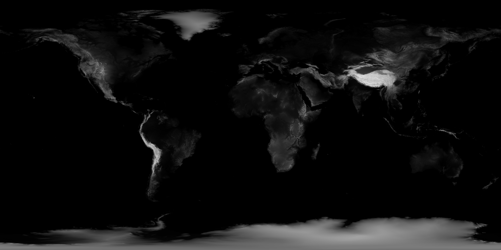
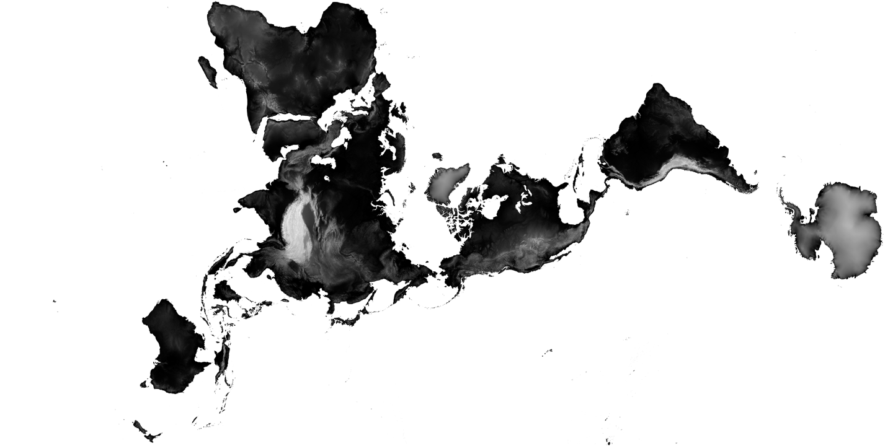

Date: 23 December 2015 01:12:21

*If you enjoy this article, please consider [donating](bioticpixels.com/supporting "Supporting Biotic Pixels").*

# Dymaxion Elevation and Shoreline Map (DESM)

*Date: 23 December 2015 01:12:21*  
*By: Biotic Pixels*

*This article is hosted on [GitHub](https://github.com/BioticPixels/BioticPixels/tree/gh-pages/articles "Articles github.com"). If there are any problems, open an [issue](https://github.com/BioticPixels/BioticPixels/issues "bioticpixels.com Issues github.com").*

*Want to comment on this article? [It was posted on Reddit](https://redd.it/3y64ae "reddit.com").*

## Introduction

Here is the end product of the work done to convert global elevation data to the [Dymaxion map projection](https://bfi.org/about-fuller/big-ideas/dymaxion-world/dymaxion-map "Buckminster Fuller Institute bfi.org") with added shoreline data.

An elaboration of the conversion is presented [later in the article](purpose "Purpose and Reasoning").

If there is enough interest, a step-by-step methodology of creating the images can be written later.

### About the Images

The images in this article are [PNGs](https://en.wikipedia.org/wiki/Portable_Network_Graphics "Portable Network Graphics wikipedia.org"), but also exist as [TIFFs](https://en.wikipedia.org/wiki/Tagged_Image_File_Format "Tagged Image File Format wikipedia.org"). The PNGs are at least [5K resolution](https://en.wikipedia.org/wiki/5K_resolution "5K resolution wikipedia.org") (5120x2880px), but the TIFFs are 43200x21600px. Here is a scale to show how big the originals really are:  

Here is a link to [all the images in this article](images "Article Images Including TIFFs"), including the original, full resolution TIFFs, and 5K resolution PNGs.

The images were created using [GEBCO][0] elevation data, [VMap0][1] shoreline data, [QGIS](http://www.qgis.org/en/site/ "QGIS qgis.org"), [Photoshop](http://www.photoshop.com/products/photoshop "Photoshop photoshop.com"), and a modified [Dymaxify Perl script, dymaxify3.pl](https://github.com/BioticPixels/Dymaxify "Dymaxify Perl Scripts github.com").

#### About the Script

dymaxify3.pl, the Dymaxify script, is a modified version of a script by Schuyler D. Erle, and was originally downloaded from http://iconocla.st/hacks/dymax/dymaxify.pl, however that site is no longer available.

This script uses a Perl module called Geo::Dymaxion, again by Schuyler D. Erle, and can be found at [The Comprehensive Perl Archive Network  (CPAN)](https://metacpan.org/pod/Geo::Dymaxion "metacpan.org"). It plots latitude/longitude on a Fuller Dymaxion map, and the script gave an easy way to do this.

As much as the script was easy to start running, the interpolation method is very crude, and could be improved.

### Images

*The original elevation data. [Get the source data here][0].*

*Dymaxified elevation data with no background. Get the [full resolution TIFF here](https://drive.google.com/file/d/0B4ugcbzXgPzQWkRORjJWVEtkWTA/view?usp=sharing "Elevation TIFF") (93.5MB).*

*Elevation data with the oceans converted to alpha.*

*Dymaxified elevation data with the oceans and background converted to alpha. Get the [full resolution TIFF here](https://drive.google.com/file/d/0B4ugcbzXgPzQVEduYkI3S1J1bTQ/view?usp=sharing "Elevation with Alpha TIFF") (149.7MB).*

*Dymaxified elevation data with the oceans (green) and background (red). Get the [full resolution TIFF here](https://drive.google.com/file/d/0B4ugcbzXgPzQNFdkazRuSmQ3ZUE/view?usp=sharing "Elevation with Oceans and Background TIFF") (114.2MB).*

#### Bonus

This is what happens when the elevation data is put through the Dymaxify script twice at 5K resolution.

*Dymaxified elevation data run through the Dymaxify script again, converting everything but the landmasses to alpha.*

*Dymaxified elevation data run through the Dymaxify script again, this time retaining the oceans (green) and background (red and blue) data.*

## Purpose and Reasoning

There are two reasons for producing these maps, high quality, easily accessible, realistic [two and a half dimensional (2.5D)](https://en.wikipedia.org/wiki/2.5D "2.5D wikipedia.org") terrain in the form of a [Digital Elevation Model](https://en.wikipedia.org/wiki/Digital_elevation_model "Digital Elevation Model wikipedia.org") (DEM), and in a low distortion 2D [map projection](https://en.wikipedia.org/wiki/Map_projection "Map Projection wikipedia.org") with minimum landmass interruption in the form of the [Dymaxion Projection][2].

### Digital Elevation Maps (DEMs)

The two main ways of creating realistic terrain data for digital manipulation are to either to simulate it using [geomorphological models](https://www.youtube.com/watch?v=kkuZtm7ENOA "Landscape Evolution youtube.com"), or use terrain data that already exists as a DEM, also known as height maps, which is elevation data converted to greyscale bitmap data.

A DEM was chosen because simulating terrain formation is complicated, software currently built that does this is not easily accessible, and the results are not guaranteed to be entirely realistic. Whereas DEMs provide realistic data and is easy to acquire. The tradeoff is that DEMs may not be near the detail of simulated data, and the parameters for its creation are completely fixed which is not the case with simulated data.

### Map Projection

[Map projections](https://en.wikipedia.org/wiki/Map_projection "Map Projection wikipedia.org") seeks to convert 2D data in 3D space, the surface of the Earth for example, to just 2D data.

DEMs are usually presented in the [equirectangular map projection](https://en.wikipedia.org/wiki/Equirectangular_projection "Equirectangular Projection wikipedia.org"), which possess large amounts of unwanted distortion particularly at the poles, so a map projection with much less distortion is needed. One such projection is the [Dymaxion map projection][2], another being the [Waterman butterfly projection](https://en.wikipedia.org/wiki/Waterman_butterfly_projection "Waterman Butterfly Projection wikipedia.org"). Both these projections essentially transform the [spheroid](https://en.wikipedia.org/wiki/Spheroid "Spheroid wikipedia.org") Earth to a 3D shape with flat sides, such as a [polyhedron](https://en.wikipedia.org/wiki/Polyhedron "Polyhedron wikipedia.org"), which is then unfolded while attempting to avoid splitting the shape on edges that intersect land.

The Dymaxion Projection was chosen over the Waterman Butterfly Projection because the overall shape is more consistent, and fewer landmasses are intersected, namely Greenland.

## About The Data

The DESM was created using 'GEBCO' elevation data found at [NASA's Visible Earth][0], and 'VMap0' shoreline data found at [GIS Lab][1].

There is better data than the 'GEBCO' DEM data, namely 'ASTER GDEM' found at [Joint Space Systems](http://gdem.ersdac.jspacesystems.or.jp/search.jsp "jspacesystems.or.jp") and [the United States Geological Survey (USGS)](http://gdex.cr.usgs.gov/gdex/ "usgs.gov"), however this is considerably higher resolution, and would have taken a considerably longer period of time to process (read weeks), and would be better done with a unified script.

There is also better coastline data, namely 'Global Shoreline Data' found at [the National Geospatial-Intelligence Agency (NGA)](http://msi.nga.mil/NGAPortal/DNC.portal?_nfpb=true&_pageLabel=dnc_portal_page_72 "nga.mil"), however this would take quite some time to put together.

Many useful links were found in [an article on OceanTeacher.org](http://library.oceanteacher.org/OTMediawiki/index.php/Coastlines_and_Land_Masks#World_Vector_Shoreline_.28WVS.29 "oceanteacher.org").

[0]: http://visibleearth.nasa.gov/view.php?id=73934 "NASA Visible Earth visibleearth.nasa.gov"
[1]: http://gis-lab.info/qa/vmap0-eng.html "gis-lab.info"
[2]: https://en.wikipedia.org/wiki/Dymaxion_map "Dymaxion Projection wikipedia.org"
